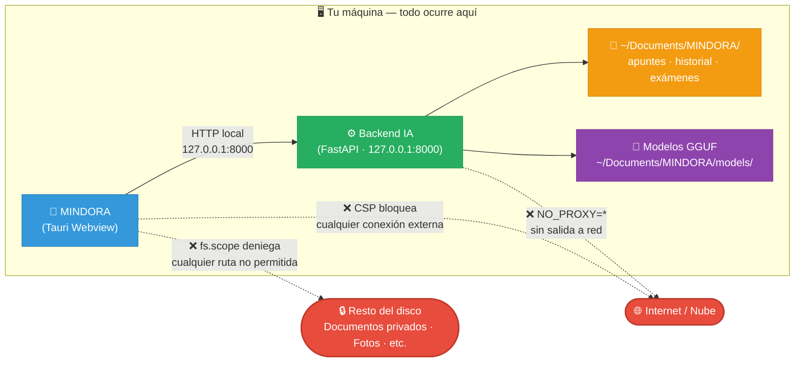

# MINDORA

<p align="center">
   
</p>

Aplicación de escritorio educativa **offline** (Tauri + React + FastAPI + LLM local).

➡️ Guía completa: [README_COMPLETO.md](README_COMPLETO.md)

➡️ Adaptación oficial Práctica 2 (LangChain + Ollama/LM Studio + app desktop macOS): [PRACTICA2_README.md](PRACTICA2_README.md)

## 1) Qué es

MINDORA permite:
- crear ramas de estudio por asignatura,
- ingerir apuntes (PDF/DOCX/PPTX/TXT/MD e imagen con OCR),
- chatear con RAG y memoria local,
- generar/corregir exámenes y simulacros,
- funcionar sin nube para contenido sensible.

---

## 2) Arquitectura técnica

- **UI Desktop**: Tauri v1 + React + TypeScript + Vite
- **Core IA**: FastAPI local en `127.0.0.1:8000`
- **RAG**: embeddings locales + FAISS + reranking híbrido
- **LLM local**: `llama-cpp-python` (GGUF)
- **Persistencia**: SQLite + archivos por rama/sesión

Estructura principal:

- `core/app/main.py`: API y middlewares (CORS, límites)
- `core/app/api/routes/*`: endpoints REST
- `core/app/services/*`: extracción, RAG, exámenes, memoria chat
- `core/run_server.py`: entrypoint del backend empaquetado
- `ui/src/App.tsx`: UI principal
- `ui/src/api.ts`: cliente HTTP
- `ui/src-tauri/src/main.rs`: arranque app y sidecar backend
- `build.sh`: build local multiplataforma (según host)

---

## 3) Requisitos

### Comunes
- Python 3.9+
- Node 18+
- Rust (rustup)

### OCR
- Tesseract instalado en sistema

### Modelo LLM
- Archivo GGUF, recomendados:
   - `qwen2.5-7b-instruct` (principal)
   - `devstral` (código, opcional)

Ubicación del modelo por OS:
- macOS: `~/Documents/MINDORA/models/`
- Windows: `%APPDATA%/MINDORA/models/`
- Linux: `~/.local/share/MINDORA/models/`

---

## 4) Instalación para desarrollo

Desde la raíz del repo:

1. Backend
   - `cd core`
   - `python3 -m pip install -r requirements.txt`

2. Frontend
   - `cd ../ui`
   - `npm install`

## 5) Instalación de modelos de IA

Los modelos se descargan automáticamente la primera vez que MINDORA los necesita, o puedes descargarlos manualmente:

### Descarga manual (recomendado)

```bash
# Crea la carpeta de modelos según tu OS:

# macOS
mkdir -p ~/Documents/MINDORA/models

# Windows (PowerShell)
New-Item -ItemType Directory -Force -Path "$env:APPDATA\MINDORA\models"

# Linux
mkdir -p ~/.local/share/MINDORA/models
```

### Modelos necesarios:

1. **Qwen 2.5 7B Instruct** (educación)
   - Descarga: https://huggingface.co/bartowski/Qwen2.5-7B-Instruct-GGUF
   - Archivo: `Qwen2.5-7B-Instruct-Q4_K_M.gguf` (4.4 GB)

2. **Devstral Small 2505** (código, opcional pero recomendado)
   - Descarga: https://huggingface.co/mistralai/Devstral-Small-2505_gguf
   - Archivo: `devstralQ4_K_M.gguf` (13 GB)

Copia ambos archivos a la carpeta de modelos y reinicia MINDORA.

3. Ejecutar en dev
   - Terminal 1: backend (`python3 core/run_server.py` desde la raíz)
   - Terminal 2: `npm run dev` en `ui`

> Si se usa empaquetado desktop, Tauri lanza el backend sidecar automáticamente.

## 6) Ruta recomendada desde GitHub

Para usar MINDORA tal y como queda la práctica:

1. Clona el repositorio.
2. Instala dependencias del backend en [core/requirements.txt](core/requirements.txt).
3. Instala dependencias del frontend en [ui/package.json](ui/package.json).
4. Ejecuta la app desktop con `npm run tauri dev` dentro de [ui](ui).
5. Para distribuir la app de macOS, ejecuta [build.sh](build.sh) y usa el `.dmg` generado.

---

## 5) Seguridad aplicada

MINDORA aplica seguridad en capas. Lo que sigue no es solo documentación: es el código real que la garantiza.

---

### 🗂️ Sandbox de sistema de ficheros (Tauri)

La app **únicamente puede leer y escribir** dentro de las carpetas de MINDORA/usuario. El scope está declarado en `ui/src-tauri/tauri.conf.json`:

```json
"fs": {
  "all": false,
  "readFile": false,
  "writeFile": true,
  "readDir": true,
  "scope": [
    "$DOCUMENT/MINDORA/**",
    "$APPDATA/MINDORA/**",
    "$HOME/.local/share/MINDORA/**",
    "$DOWNLOAD/**",
    "$DESKTOP/**"
  ]
}
```

| Ruta | Acceso | Motivo |
|------|:------:|--------|
| `~/Documents/MINDORA/**` | ✅ R/W | Modelos, datos, historial, exámenes |
| `~/Downloads/**` | ✅ Escritura | Exportar resultados |
| `~/Desktop/**` | ✅ Escritura | Exportar al escritorio |
| Cualquier otra carpeta del usuario | ❌ Denegado | Bloqueado por Tauri runtime |
| Archivos del sistema (`/etc`, `/System`) | ❌ Denegado | Completamente inaccesible |

> El sistema operativo aplica estos permisos en tiempo de ejecución. Aunque existiera un bug en el JS de la app, el SO **no permitiría** acceder a rutas fuera del scope declarado.

---

### 🚫 Sin ejecución de comandos del sistema

```json
"shell": { "all": false, "execute": false, "sidecar": false, "open": true }
```

`execute: false` → la app no puede correr `rm`, `curl`, scripts de shell ni nada similar.  
El único proceso que puede lanzar es el backend IA incluido en el paquete de la app.

---

### 🌐 Red: solo loopback (`127.0.0.1`)

**Content Security Policy del webview** (`tauri.conf.json`):
```
connect-src http://127.0.0.1:8000     ← solo backend local
script-src  'self'                     ← sin scripts de terceros
default-src 'self' tauri:              ← sin recursos externos
```

**Backend IA con salida de red bloqueada** (`ui/src-tauri/src/main.rs`):
```rust
cmd.env("NO_PROXY", "*");              // sin proxy de ningún tipo
cmd.env("REQUESTS_CA_BUNDLE", "");     // bloquea HTTPS saliente (requests lib)
```

---

### 🛡️ API local protegida (FastAPI / `core/app/main.py`)

```python
_MAX_BODY_BYTES    = 50 * 1024 * 1024  # 50 MB límite por request
_RATE_MAX_REQUESTS = 120               # máx. peticiones en 30 segundos
_RATE_WINDOW_SECONDS = 30

# CORS: solo orígenes localhost / Tauri; cualquier otro origen → 403
allow_origin_regex = r"https?://(localhost|127\.0\.0\.1)(:\d+)?"
```

---

### 🗺️ Diagrama de aislamiento



---

## 6) Funciones implementadas recientes

- Soporte de build Linux (`pyinstaller_linux.spec`, workflow Linux)
- Rutas de datos y modelos cross-platform (macOS/Windows/Linux)
- Historial de chat persistente con:
  - listar,
  - cargar,
  - eliminar,
  - renombrar,
  - fijar (pin),
  - búsqueda
- Guardado de conversación a `.txt`
- Deduplicación de headers/footers repetidos en PDF
- Guardrail de baja evidencia en `ask`: responde “no lo sé con certeza”

---

## 7) Testing y validación

### Backend
- `cd core`
- `python3 -m pytest -q`

Estado actual: **112 passed**.

### Frontend
- `cd ui`
- `npx tsc --noEmit`
- `npm run build`

Estado actual: build OK.

---

## 8) Build instalable

### Build local (host actual)
- `./build.sh`

Genera según plataforma:
- macOS: `.dmg`
- Windows: `.exe` (NSIS)
- Linux: `.AppImage` y `.deb`

### CI
- `.github/workflows/build-windows.yml`
- `.github/workflows/build-linux.yml`

---

## 9) Release checklist

1. Tests backend OK
2. Typecheck + build frontend OK
3. Build instaladores OK
4. Verificar arranque en máquina limpia por OS
5. Publicar artefactos en GitHub Releases

---

## 10) Troubleshooting rápido

- **No encuentra modelo GGUF**: revisar ruta por SO en sección 3
- **OCR no funciona**: instalar Tesseract y reiniciar app
- **Build falla en Linux**: instalar dependencias del workflow localmente (webkit2gtk/gtk/openblas)
- **Respuesta pobre**: aumentar material ingerido o hacer pregunta más específica

---

## 11) Licencia

Ver `LICENSE`.
