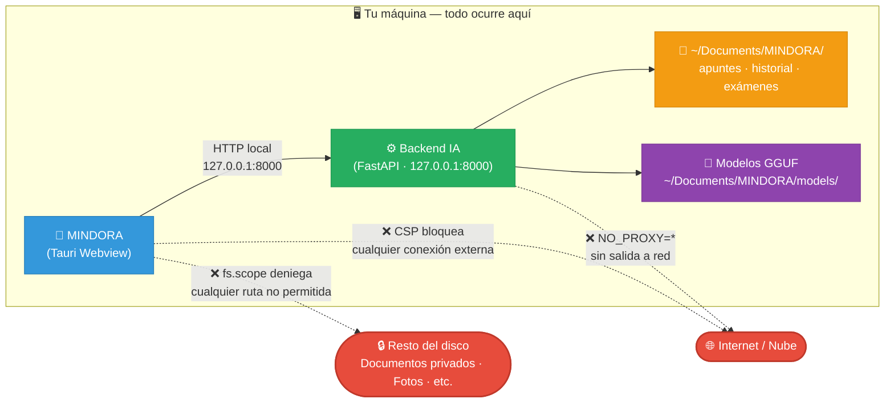

# 🤖 MINDORA – IA Educativa Offline

**Aplicación de escritorio gratuita para estudiantes. Estudia con IA sin depender de internet.**

---

## 📋 Tabla de contenidos

1. [Descripción general](#descripción-general)
2. [Características](#características)
3. [Requisitos del sistema](#requisitos-del-sistema)
4. [Instalación](#instalación)
   - [Windows](#windows)
   - [macOS](#macos)
   - [Linux](#linux)
5. [Modelos de IA incluidos](#modelos-de-ia-incluidos)
6. [Uso de MINDORA](#uso-de-mindora)
7. [Testing con TEMARIO](#testing-con-temario)
8. [Desarrollo](#desarrollo)
9. [Troubleshooting](#troubleshooting)
10. [🔒 Seguridad y Privacidad](#-seguridad-y-privacidad)
11. [Licencia](#licencia)

---

## Descripción general

**MINDORA** es una aplicación de escritorio que lleva la IA generativa al aula sin necesidad de conexión a internet.

### Características educativas:
- **Preguntas y respuestas**: Sube apuntes en PDF/Word/imagen y pregunta sobre su contenido.
- **Exámenes generados automáticamente**: Crea tests con preguntas de selección múltiple, respuesta corta, etc.
- **Modo Código**: Analiza fragmentos de código, corrige bugs y refactoriza.
- **Múltiples estilos de respuesta**: Profesor, Compañero, Examen, Detallado, por pasos, etc.
- **Historial de sesiones**: Guarda y retoma conversaciones.
- **Completamente offline**: Una vez instalada, no necesita internet.

---

## Características

✅ **Independencia de internet**: Funciona 100% offline tras instalación  
✅ **Multiplataforma**: Windows 10+, macOS 10.13+, Linux (AppImage/Deb)  
✅ **Dos modelos de IA integrados**:
   - **Qwen 2.5 7B Instruct** (educación, explicaciones)
   - **Devstral Small 2505** (análisis de código, refactorización)  
✅ **RAG + embeddings locales**: Búsqueda inteligente en documentos subidos  
✅ **OCR integrado**: Extrae texto de imágenes escaneadas  
✅ **Almacenamiento local seguro**: Todos los datos en tu máquina  
✅ **Open Source**: Modifica y redistribuye bajo licencia incluida

---

## Requisitos del sistema

### Hardware mínimo recomendado:
- **CPU**: Quad-core 2.0 GHz (8 cores para mejor rendimiento)
- **RAM**: 8 GB (16 GB recomendado)
- **Almacenamiento**: 30 GB libres (20 GB para modelos + 10 GB para datos)
- **GPU** (opcional): NVIDIA/AMD/Metal aceleran respuestas, pero no es obligatorio

### Software:
- **Windows**: 10 / 11 (64-bit)
- **macOS**: 10.13+ (Intel o Apple Silicon)
- **Linux**: Ubuntu 18.04+, Debian 10+, Fedora 30+ (64-bit)

---

## Instalación

### Windows

#### Opción 1: Instalador ejecutable (recomendado)

1. Descarga `MINDORA-x.x.x-win.msi` desde [GitHub Releases](https://github.com/endikapradera/MINDORA/releases)
2. Ejecuta el archivo `.msi`
3. Sigue el asistente de instalación
4. Elige la carpeta de destino (por defecto: `C:\Program Files\MINDORA`)
5. Al finalizar, se crea un acceso directo en el escritorio

#### Opción 2: Carpeta portátil

1. Descarga `MINDORA-x.x.x-win-portable.zip`
2. Extrae en cualquier carpeta
3. Ejecuta `MINDORA.exe`

#### Instalación de modelos (Windows)

Una vez instalada la app:

1. Abre el explorador: `Ctrl + R` → escribe `%APPDATA%\MINDORA\models`
2. Si la carpeta no existe, créala
3. Descarga los modelos:
   - [Qwen2.5-7B-Instruct-Q4_K_M.gguf](https://huggingface.co/bartowski/Qwen2.5-7B-Instruct-GGUF) (4.4 GB)
   - [devstralQ4_K_M.gguf](https://huggingface.co/mistralai/Devstral-Small-2505_gguf) (13 GB)
4. Copia ambos `.gguf` a la carpeta de modelos
5. Reinicia MINDORA

**Tiempo estimado**: ~20 minutos (depende de tu conexión)

---

### macOS

#### Opción 1: Instalador DMG

1. Descarga `MINDORA-x.x.x-mac.dmg` desde [GitHub Releases](https://github.com/endikapradera/MINDORA/releases)
2. Ejecuta el archivo `.dmg`
3. Arrastra el icono de MINDORA a la carpeta Applications
4. Abre Applications → MINDORA

#### Opción 2: Homebrew (si está disponible)

```bash
brew tap endikapradera/mindora
brew install mindora
```

#### Instalación de modelos (macOS)

1. Abre Terminal: `Cmd + Space` → escribe `Terminal`
2. Crea la carpeta de modelos:
   ```bash
   mkdir -p ~/Documents/MINDORA/models
   ```
3. Descarga los modelos (puedes usar `aria2c` para descargas más rápidas):
   ```bash
   cd ~/Documents/MINDORA/models
   # Opción A: Con curl (más lento)
   curl -L -o Qwen2.5-7B-Instruct-Q4_K_M.gguf \
     https://huggingface.co/bartowski/Qwen2.5-7B-Instruct-GGUF/resolve/main/Qwen2.5-7B-Instruct-Q4_K_M.gguf
   
   # Opción B: Con aria2c (más rápido, si lo tienes instalado)
   aria2c -x 10 "https://huggingface.co/.../Qwen2.5-7B-Instruct-Q4_K_M.gguf"
   ```
4. Repite para `devstralQ4_K_M.gguf`
5. Reinicia MINDORA

**Nota macOS**: Si ves "No se puede abrir porque no está identificado", haz clic derecho sobre MINDORA → Abrir → Abre.

---

### Linux

#### Opción 1: AppImage (universal)

1. Descarga `MINDORA-x.x.x-linux.AppImage` desde [GitHub Releases](https://github.com/endikapradera/MINDORA/releases)
2. Dale permisos de ejecución:
   ```bash
   chmod +x MINDORA-*.AppImage
   ```
3. Ejecuta:
   ```bash
   ./MINDORA-*.AppImage
   ```

#### Opción 2: Paquete Debian/Ubuntu

```bash
sudo apt update
sudo apt install ./MINDORA-x.x.x-linux.deb
mindora  # Ejecuta desde terminal
```

#### Instalación de modelos (Linux)

1. Crea la carpeta:
   ```bash
   mkdir -p ~/.local/share/MINDORA/models
   ```
2. Descarga los modelos:
   ```bash
   cd ~/.local/share/MINDORA/models
   wget "https://huggingface.co/.../Qwen2.5-7B-Instruct-Q4_K_M.gguf"
   wget "https://huggingface.co/.../devstralQ4_K_M.gguf"
   ```
3. Reinicia MINDORA

**Nota**: Usa `aria2c` para descargas en paralelo (4-10x más rápido):
```bash
aria2c -x 10 -k 1M "https://huggingface.co/.../archivo.gguf"
```

---

## Modelos de IA incluidos

### Qwen 2.5 7B Instruct (Educación)

**Propósito**: Explicaciones educativas, resumen, análisis de documentos  
**Tamaño**: 4.4 GB (Q4 cuantizado)  
**Velocidad**: ~3–8 tokens/segundo (según CPU)  
**Idiomas**: Español, inglés, chino, y 20+ más  
**Características**:
- Excelente en matemáticas y explicaciones paso a paso
- Cita fuentes recuperadas automáticamente
- Compatible con RAG (Retrieval-Augmented Generation)

**Casos de uso**:
- "Explícame las leyes de Newton"
- "Resumen de este PDF sobre historia"
- "Diferencia entre fotosíntesis y respiración celular"

---

### Devstral Small 2505 (Código)

**Propósito**: Análisis, refactorización y explicación de código  
**Tamaño**: 13 GB (Q4 cuantizado)  
**Velocidad**: ~2–5 tokens/segundo  
**Lenguajes soportados**: Python, JavaScript, Java, C++, SQL, HTML/CSS, y más  
**Características**:
- Identifica bugs automáticamente
- Sugiere mejoras de legibilidad
- Explica línea por línea
- Refactorización segura

**Casos de uso**:
- "Este código crashea, ¿por qué?"
- "Optimiza este loop"
- "Explícame qué hace esta función"

---

## Uso de MINDORA

### Inicio rápido

1. **Abre MINDORA** → Espera 5–10 segundos a que carguen los modelos
2. **Sube documentos**: Click en "Añadir documento" → Elige PDF/Word/imagen/txt
3. **Haz preguntas**: Escribe tu pregunta en el chat → Elige estilo de respuesta
4. **Modo Código**: Cambia a "Código" → Pega fragmento de código → Click "Analizar"

### Estilos de respuesta

- **Auto**: Elige automáticamente según la pregunta
- **Profesor**: Estructura formal, con introducción y conclusión
- **Compañero**: Tono casual, amigable
- **Corta**: Máximo 6 líneas
- **Detallada**: Explicación profunda con ejemplos
- **Por pasos**: Desglosada en pasos numerados
- **Examen**: Formato de pregunta de examen

---

## Testing con TEMARIO

MINDORA incluye un **banco de preguntas exhaustivo** basado en el temario educativo. Para validar que funciona correctamente:

### Estructura del TEMARIO

```
TEMARIO/
├── A1 - LÓGICA/
├── A2 - DIMENSIONES SEGURIDAD/
├── A3 - ESTADÍSTICA Y OP/
├── A4 - PRIN. JURIDICOS CIBER/
├── A5 - PROG. ESTRUCTURAS LINEALES/
├── ... (más ramas temáticas)
└── preguntas-temario.txt    # Banco maestro de preguntas
```

### Ejecutar tests automáticamente

Desde la carpeta `core/`:

```bash
# Test simple: Preguntas básicas de cada tema
python3 -m pytest tests/test_temario_basic.py -v

# Test exhaustivo: Todos los niveles
python3 -m pytest tests/test_temario_full.py -v

# Test de generación de exámenes
python3 -m pytest tests/test_exam_generation.py -v

# Test de modo código
python3 -m pytest tests/test_code_mode.py -v
```

### Testing manual

1. **Carga documentos de TEMARIO**: Desde la carpeta A1, A2, etc., sube PDFs/apuntes
2. **Formula preguntas**: Usa las preguntas de `preguntas-temario.txt`
3. **Valida respuestas**: Comprueba que sean correctas y coherentes
4. **Documenta problemas**: Si algo falla, anótalo para el debugging

---

## Desarrollo

### Estructura del proyecto

```
MINDORA/
├── core/                       # Backend FastAPI + LLM
│   ├── app/
│   │   ├── api/routes/        # Endpoints
│   │   ├── services/          # Lógica: RAG, LLM, análisis
│   │   ├── schemas/           # Definiciones de datos
│   │   └── storage/           # Base de datos SQLite
│   ├── run_server.py          # Punto de entrada
│   ├── requirements.txt        # Dependencias Python
│   ├── pyinstaller.spec       # Build macOS
│   ├── pyinstaller_linux.spec # Build Linux
│   └── tests/                 # Pruebas pytest
├── ui/                         # Frontend React + Tauri
│   ├── src/                   # Componentes React
│   ├── src-tauri/             # Código Rust + configuración Tauri
│   ├── package.json           # Dependencias npm
│   └── vite.config.ts         # Configuración build
├── README.md                  # Este archivo
└── build.sh                   # Script de build para macOS
```

### Entorno de desarrollo

#### Requisitos previos

```bash
# Python 3.9+
python3 --version

# Node.js 18+
node --version

# Rust (para Tauri)
curl --proto '=https' --tlsv1.2 -sSf https://sh.rustup.rs | sh
```

#### Setup backend

```bash
cd core
python3 -m venv venv
source venv/bin/activate  # En Windows: venv\Scripts\activate
pip install -r requirements.txt
```

#### Setup frontend

```bash
cd ui
npm install
```

#### Ejecutar en desarrollo

Terminal 1 (Backend):
```bash
cd core
source venv/bin/activate
python3 run_server.py
```

Terminal 2 (Frontend):
```bash
cd ui
npm run tauri dev
```

### Build para producción

#### macOS

```bash
./build.sh
# Genera: ui/src-tauri/target/release/bundle/dmg/MINDORA.dmg
```

#### Windows

```bash
cd ui
npm run tauri build -- --target x86_64-pc-windows-msvc
# Genera: src-tauri/target/release/bundle/msi/MINDORA_x.x.x_x64_en-US.msi
```

#### Linux

```bash
cd ui
npm run tauri build
# Genera: src-tauri/target/release/bundle/AppImage/MINDORA.AppImage
#     y: src-tauri/target/release/bundle/deb/MINDORA.deb
```

---

## Troubleshooting

### "Modelo no encontrado"

**Síntoma**: La app muestra "⚠️ Modelo no encontrado"

**Solución**:
1. Comprueba que los archivos `.gguf` están en la carpeta correcta:
   - Windows: `%APPDATA%\MINDORA\models`
   - macOS: `~/Documents/MINDORA/models`
   - Linux: `~/.local/share/MINDORA/models`
2. Verifica que el nombre del archivo es exacto (case-sensitive en Linux)
3. Comprueba espacio en disco disponible
4. Reinicia la app

### "La app se tarda mucho en responder"

**Posibles causas**:
- CPU débil (menos de 4 cores)
- Documento muy grande
- Falta de RAM

**Soluciones**:
- Reduce el tamaño del documento (máx. 20 MB)
- Cierra otras aplicaciones
- Aumenta el timeout en `config.yaml`

### "Error de OCR"

**Síntoma**: Las imágenes escaneadas no se leen

**Solución**:
1. Verifica que Tesseract está instalado:
   - macOS: `brew install tesseract`
   - Linux: `sudo apt install tesseract-ocr`
   - Windows: Descarga desde [GitHub](https://github.com/UB-Mannheim/tesseract/wiki)
2. Reinicia la app

### Crash al subir documento grande

**Solución**:
1. Divide el PDF en partes de <20 MB
2. Usa "Procesar por páginas" en opciones
3. Comprueba RAM disponible: `free -h` (Linux/macOS) o Task Manager (Windows)

### "Conexión denegada al backend"

**Síntoma**: Frontend no puede conectar con el backend

**Solución**:
1. Comprueba que el backend está corriendo: `curl http://127.0.0.1:8000/health`
2. Reinicia la app
3. Comprueba puerto 8000 no esté en uso: `lsof -i :8000` (macOS/Linux)

---

## Casos de uso avanzados

### Crear un examen personalizado

```
1. Abre MINDORA
2. Sube apuntes/libro en PDF
3. Click "Generar examen"
4. Elige:
   - Número de preguntas (5–50)
   - Nivel (básico, medio, avanzado)
   - Tipo (selección múltiple, respuesta corta, desarrollo)
5. Descarga PDF con examen + solucionario
```

### Analizar código en equipo

```
1. Cambia a modo "Código"
2. Pega o arrastra archivo `.py`, `.js`, etc.
3. Click "Analizar"
4. Usa "Refactorizar", "Explicar", "Optimizar"
5. Comparte resultados (copia-pega o descarga)
```

### Estudiar de forma adaptativa

```
1. Carga documentos de un tema
2. Haz preguntas en orden: Básico → Medio → Avanzado
3. Si fallas, repasa esa sección
4. Usa modo "Examen" para autoevaluarte
5. Guarda el historial para seguimiento
```

---

## FAQs

**P: ¿Es completamente gratuito?**  
R: Sí, MINDORA es open source y gratuito. Los modelos IA también son open source.

**P: ¿Puedo usar mis propios modelos?**  
R: Sí. Reemplaza los `.gguf` en la carpeta `models/` por los tuyos. Asegúrate de que sean compatibles con `llama.cpp`.

**P: ¿Funciona offline sin internet?**  
R: Completamente. Una vez instalada y con modelos descargados, no necesita conexión.

**P: ¿Qué pasa con mis datos?**  
R: Todo se guarda localmente en tu máquina. Nunca enviamos datos a servidores externos.

**P: ¿Puedo modificar la IA?**  
R: El código es open source. Puedes fork, modificar y compila tu propia versión.

**P: ¿Soporta otros idiomas?**  
R: Sí, ambos modelos soportan español, inglés, chino, francés, etc.

---

## 🔒 Seguridad y Privacidad

> **Principio fundamental**: Todo lo que introduces en MINDORA se queda en tu máquina. Siempre.

MINDORA fue diseñada con un modelo de **aislamiento estricto**. A continuación se explica exactamente qué puede y qué no puede hacer la app en tu sistema — con el código real que lo garantiza.

---

### 📁 Acceso al sistema de ficheros: solo tu carpeta MINDORA

Una de las preguntas más frecuentes: _¿puede la app ver mis documentos, fotos o archivos privados?_

**La respuesta es no.** El acceso al disco está declarado explícitamente en el código fuente
([`ui/src-tauri/tauri.conf.json`](ui/src-tauri/tauri.conf.json)):

```json
"fs": {
  "all": false,
  "readFile": false,
  "writeFile": true,
  "readDir": true,
  "scope": [
    "$DOCUMENT/MINDORA/**",
    "$APPDATA/MINDORA/**",
    "$HOME/.local/share/MINDORA/**",
    "$DOWNLOAD/**",
    "$DESKTOP/**"
  ]
}
```

Traducido a una tabla:

| Carpeta | ¿Accesible? | Motivo |
|---------|:-----------:|--------|
| `~/Documents/MINDORA/` | ✅ Sí | Modelos, apuntes, historial, exámenes |
| `~/Downloads/` | ✅ Solo escritura | Exportar exámenes y resultados |
| `~/Desktop/` | ✅ Solo escritura | Exportar al escritorio |
| `~/Documents/trabajo/` (u otras carpetas tuyas) | ❌ No | Bloqueado por Tauri runtime |
| `~/Pictures/`, `~/Videos/`, `~/Music/` | ❌ No | Bloqueado por Tauri runtime |
| `/etc/`, `/System/`, archivos del SO | ❌ No | Completamente inaccesible |
| Archivos de otras aplicaciones | ❌ No | Sin acceso a ninguna ruta no declarada |

> 💡 **Garantía técnica**: Tauri aplica estos permisos a nivel de runtime. Aunque hubiera un bug en el código JavaScript de la app, el sistema operativo **no permitiría** el acceso a rutas fuera del scope declarado.

---

### 🚫 La app no puede ejecutar comandos del sistema

MINDORA no puede ejecutar comandos de shell arbitrarios. Está desactivado explícitamente en
[`ui/src-tauri/tauri.conf.json`](ui/src-tauri/tauri.conf.json):

```json
"shell": {
  "all": false,
  "execute": false,
  "open": true,
  "sidecar": false
}
```

| Permiso | Valor | Qué significa |
|---------|:-----:|---------------|
| `execute` | ❌ `false` | No puede correr `rm`, `curl`, scripts ni ningún comando del SO |
| `sidecar` | ❌ `false` | No puede lanzar procesos externos desconocidos |
| `open` | ✅ `true` | Solo puede abrir URLs en tu navegador predeterminado |

---

### 🌐 Sin conexión a internet: todo es local

La app y su backend IA trabajan exclusivamente en `127.0.0.1` (loopback). Hay dos capas independientes que bloquean cualquier conexión externa:

**Capa 1 — Content Security Policy del webview** (en `tauri.conf.json`):

```
default-src 'self' tauri: https://tauri.localhost
connect-src http://127.0.0.1:8000     ← solo el backend local
script-src  'self'                     ← sin scripts de terceros
img-src     'self' data: blob:         ← sin imágenes externas
font-src    'self' data:               ← sin fuentes externas
```

**Capa 2 — Backend IA con red bloqueada** (código Rust en `ui/src-tauri/src/main.rs`):

```rust
cmd.env("NO_PROXY", "*");              // no usar ningún proxy de red
cmd.env("REQUESTS_CA_BUNDLE", "");     // deshabilita HTTPS saliente en librería requests
```

Resultado: el proceso de IA que analiza tus apuntes **nunca puede hacer peticiones HTTP externas**.

---

### 🗄️ Dónde se almacenan tus datos

| Tipo de dato | Ubicación en disco | ¿Sale de tu máquina? |
|---|---|:---:|
| Apuntes y documentos subidos | `~/Documents/MINDORA/<rama>/docs/` | ❌ Nunca |
| Historial de chat (SQLite) | `~/Documents/MINDORA/storage.db` | ❌ Nunca |
| Exámenes generados | `~/Documents/MINDORA/<rama>/exams/` | ❌ Nunca |
| Vectores / embeddings (FAISS) | `~/Documents/MINDORA/<rama>/index/` | ❌ Nunca |
| Modelos de IA (`.gguf`) | `~/Documents/MINDORA/models/` | ❌ Nunca |
| Telemetría / analíticas | — | ✅ No existe |
| Datos enviados a servidores | — | ✅ No existen |

---

### 🛡️ Protecciones adicionales del API local

El servidor FastAPI que gestiona la IA incorpora sus propias defensas
(código en [`core/app/main.py`](core/app/main.py)):

| Protección | Valor | Efecto |
|---|---|---|
| Tamaño máximo por petición | 50 MB | Previene abusos de memoria |
| Rate limiting | 120 req / 30 s | Evita bucles infinitos o saturación |
| CORS estricto | Solo `localhost` / `127.0.0.1` | Bloquea peticiones desde sitios web externos |
| Origen de datos | Solo archivos explícitamente subidos | Sin acceso a ficheros externos |

```python
# core/app/main.py — extracto real
_MAX_BODY_BYTES    = 50 * 1024 * 1024  # 50 MB límite por request
_RATE_MAX_REQUESTS = 120               # peticiones por ventana de tiempo
_RATE_WINDOW_SECONDS = 30              # duración de la ventana

# CORS: rechaza cualquier origen que no sea localhost
allow_origin_regex = r"https?://(localhost|127\.0\.0\.1)(:\d+)?"
```

---

### 🗺️ Diagrama de aislamiento completo



---

### ✅ Tabla resumen de garantías

| Garantía | Mecanismo que la aplica | Verificable en |
|---|---|---|
| Solo accede a carpeta MINDORA | `fs.scope` | [`ui/src-tauri/tauri.conf.json`](ui/src-tauri/tauri.conf.json) |
| Sin ejecución de comandos del SO | `shell.execute = false` | [`ui/src-tauri/tauri.conf.json`](ui/src-tauri/tauri.conf.json) |
| Sin conexión a internet (UI) | Content Security Policy | [`ui/src-tauri/tauri.conf.json`](ui/src-tauri/tauri.conf.json) |
| Sin conexión a internet (IA) | `NO_PROXY=*` en proceso backend | [`ui/src-tauri/src/main.rs`](ui/src-tauri/src/main.rs) |
| Sin telemetría ni analytics | No existe ningún cliente de telemetría | Todo el código fuente |
| Datos solo locales | Sin llamadas a APIs externas | `core/app/main.py`, `core/app/services/` |

> 🔍 **¿Quieres verificarlo tú mismo?** Todo el código es open source. Puedes auditar estos archivos directamente en [github.com/endikapradera/MINDORA](https://github.com/endikapradera/MINDORA).

---

## Contribuir

¡Contribuciones bienvenidas! Para reportar bugs o sugerir features:

1. Abre un [issue en GitHub](https://github.com/endikapradera/MINDORA/issues)
2. Describe el problema o feature con detalle
3. Adjunta logs si es un bug: `~/.local/share/MINDORA/logs/` (Linux) o equivalente en tu OS

---

## Licencia

MINDORA se distribuye bajo **licencia [LICENSE.txt](./LICENSE)** incluida en el repositorio.

Modelos IA:
- **Qwen 2.5**: [Apache 2.0](https://huggingface.co/Qwen/Qwen2.5-7B-Instruct)
- **Devstral**: [Mistral AI Community License](https://mistral.ai)

---

## Contacto y soporte

- **GitHub**: [github.com/endikapradera/MINDORA](https://github.com/endikapradera/MINDORA)
- **Issues**: [GitHub Issues](https://github.com/endikapradera/MINDORA/issues)
- **Correo**: [followme2024x@gmail.com](mailto:followme2024x@gmail.com)

---

**Hecho con ❤️ para estudiantes que quieren aprender mejor.**

*Última actualización: 25 de marzo de 2026*
